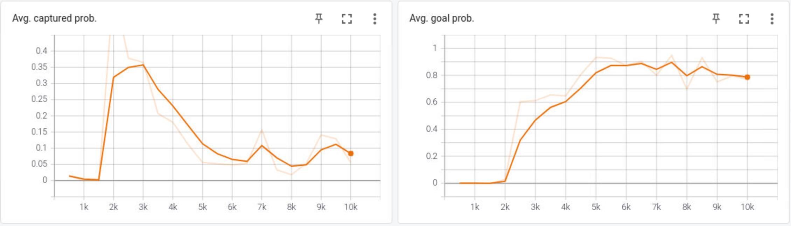
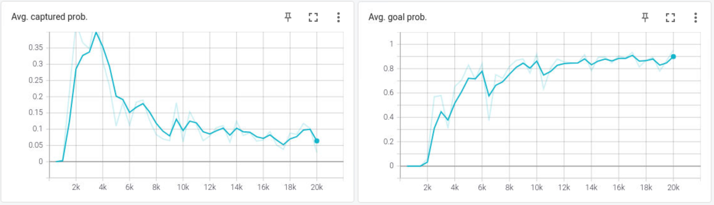

# Half Field Offense in Robocup 2D Soccer with reinforcement learning


WIP (Work In Progress): multi-agent coordination, self-play autocurricula, co-evolution strategy, and ad-hoc teamplay.

## Results

- Evaluation frequency: every 500 episodes
- Evaluation length: 1k episodes

### 1v1 against the world champion [HELIOS](https://en.wikipedia.org/wiki/RoboCup_2D_Soccer_Simulation_League)
  
  

### 2v1 against HELIOS

  

### 2v2 against HELIOS

  

## Setting

### Algorithm

Independent [PA-DDPG](https://arxiv.org/abs/1511.04143), i.e., there is no centralized critic or communication. Each agent acts asynchronously. Multi-agent cooperation can be implemented using redis or ray.

### Reward function
+1 if goal, else 0 (sparse reward)

### Offense action space

Same as [MAPQN](https://arxiv.org/abs/1903.04959), there are 3 mid-level parameterized actions (kick to, move to, dribble to)
 and a discrete high-level action (shoot) for offense players to choose.

### Observation space

Low level features in HFO.

## Examples

Use command ```--help``` for more parameter settings.

### Connect to hfo-server
You can adjust the number of players in training and evaluation accordingly (e.g. for self-play).

```bash
python connect.py --offense-agents 2 --defense-agents 0 --defense-npcs 1 --server-port 6000
```

(optional)
```bash
redis-server
```

### Training

Start a learner for an agent:

```bash
python learner.py --tensorboard-dir agent1 --save-dir agent1
```

### Evaluation

Start an evaluator for an agent:

```bash
python evaluator.py --tensorboard-dir agent1 --save-dir agent1 --episodes 20000
```

### 2v2 example

PDDPG 2v2 training:
```bash
python connect.py --offense-agents 2 --defense-agents 0 --defense-npcs 2 --server-port 6000
python learner.py --tensorboard-dir agent1 --save-dir agent1
python learner.py --tensorboard-dir agent2 --save-dir agent2
```

Evaluate PDDPG 2v2 model:
```bash
python connect.py --offense-agents 2 --defense-agents 0 --defense-npcs 2 --server-port 6000
python evaluator.py --tensorboard-dir agent1 --save-dir agent1
python evaluator.py --tensorboard-dir agent2 --save-dir agent2
```

## Citing

If this repo helped you, please consider citing.

## Reference

The code in this repo has refered to [HFO](https://github.com/LARG/HFO),
[MP-DQN](https://github.com/cycraig/MP-DQN), 
[PA-DDPG](https://arxiv.org/abs/1511.04143),
[gym-soccer](https://github.com/openai/gym-soccer). Many thanks!