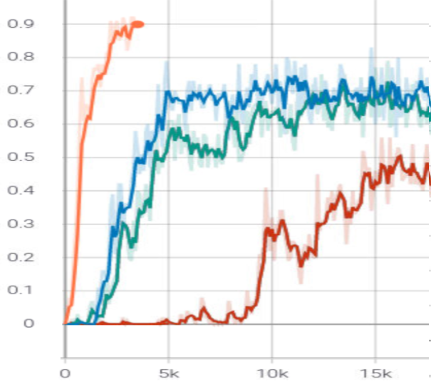

# Half Field Offense in Robocup 2D Soccer with reinforcement learning

WIP (Work In Progress): multi-agent coordination, self-play, co-evolution strategy, and ad-hoc teamplay.

## Results

### win rate



- 1v0: 90% in 4k episodes

- 1v1: 70% in 5k episodes

- 2v1: 70% in 15k episodes

- 2v2: 50% in 20k episodes

## Setting

### Reward function
+1 if goal, else 0 (sparse reward)

### Offense action space
The same as [MAPQN](https://arxiv.org/abs/1903.04959), 3 mid-level parameterized actions (kickto, moveto, dribbleto)
 and a discrete high-level action (shoot) for offense players.

## Examples

You can adjust the number of players in training and evaluation according to the examples below.

### 1v0

To reproduce PDDPG 1v0 training results, run
```bash
python connect.py --offense-agents 1 --defense-agents 0 --defense-npcs 1 --server-port 6000
python learner.py --tensorboard-dir agent1 --save-dir agent1
```

### 1v1

To reproduce PDDPG 1v1 training results, run
```bash
python connect.py --offense-agents 1 --defense-agents 0 --defense-npcs 1 --server-port 6000
python learner.py --tensorboard-dir agent1 --save-dir agent1
```

### 2v1

To reproduce PDDPG 2v1 training results, run
```bash
python connect.py --offense-agents 2 --defense-agents 0 --defense-npcs 1 --server-port 6000
python learner.py --tensorboard-dir agent1 --save-dir agent1
python learner.py --tensorboard-dir agent2 --save-dir agent2
```

### 2v2

To reproduce PDDPG 2v2 training results, run
```bash
python connect.py --offense-agents 2 --defense-agents 0 --defense-npcs 2 --server-port 6000
python learner.py --tensorboard-dir agent1 --save-dir agent1
python learner.py --tensorboard-dir agent2 --save-dir agent2
```

### Evaluation

To evaluate trained 1v1 model, run below after training
```bash
python connect.py --offense-agents 1 --defense-agents 0 --defense-npcs 1 --server-port 6000
python evaluator.py --tensorboard-dir agent1 --save-dir agent1
```

To evaluate PDDPG 2v2 model, run below after training
```bash
python connect.py --offense-agents 2 --defense-agents 0 --defense-npcs 2 --server-port 6000
python evaluator.py --tensorboard-dir agent1 --save-dir agent1
python evaluator.py --tensorboard-dir agent2 --save-dir agent2
```

## Citing

If this repo helped you, please consider citing.

## Reference

The code in this repo has refered to the code of [HFO](https://github.com/LARG/HFO),
[MP-DQN](https://github.com/cycraig/MP-DQN), 
[PA-DDPG Hausknecht & Stone 2016](https://arxiv.org/abs/1511.04143),
[gym-soccer](https://github.com/openai/gym-soccer). Many thanks!